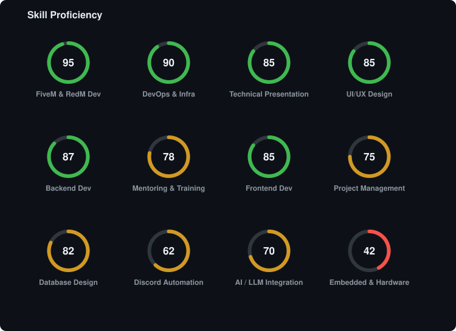
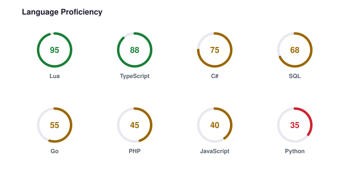
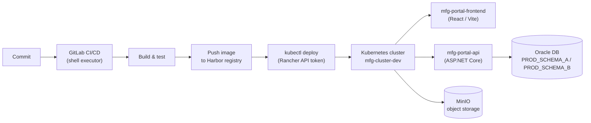
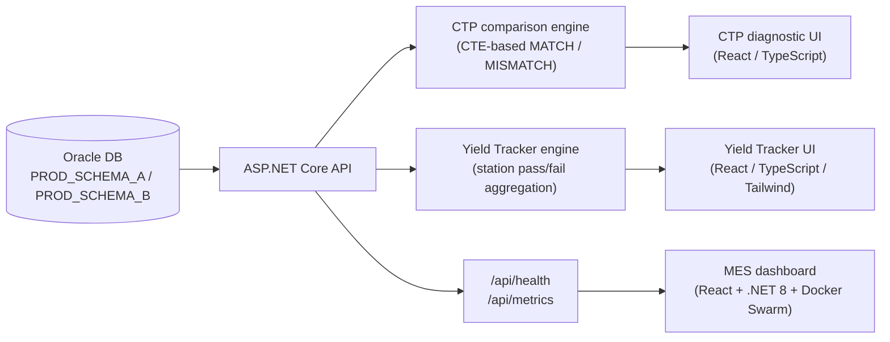
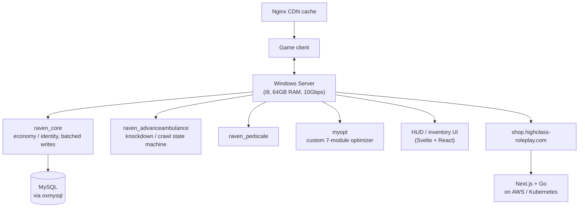
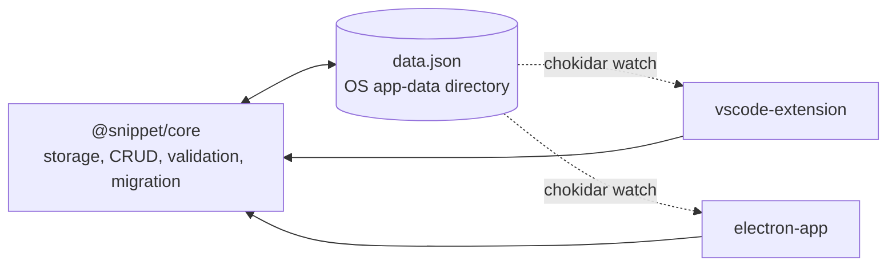
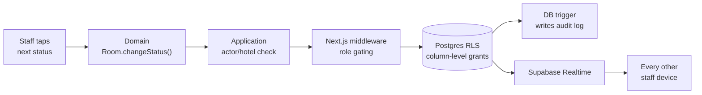

# Ekdanai Kummee (RAVEN)

**Application Engineer**, Delta Electronics Thailand

[GitHub: raven-clown](https://github.com/raven-clown)

 

 

 

 

---

## About

I'm a junior developer at Delta Electronics Thailand, on the IT manufacturing systems team, where I handle both DevOps and full-stack web development for the factory's MES (Manufacturing Execution System) tooling. I also run my own projects end to end: planning them, building them, presenting them to the team, and supporting the people who use them afterward.

Outside of work, I've spent about five years building and operating multiplayer game-server platforms (FiveM and RedM), which is where most of my backend, database, and systems-architecture experience actually comes from before I ever touched a corporate codebase. I taught myself Lua well enough to write almost anything in it from memory, and that same instinct for "just build the thing and fix what breaks" carried over into everything else here: DevOps, backend APIs, database design, and UI.

This repository is a map of that work. This page is the summary.

- [`about/`](./about): who I am outside of the job title, how I work, and personal background.
- [`experience/`](./experience): the portfolio, concrete projects and what came out of them.
- [`brain/`](./brain): the knowledge base, how each skill area actually works, in detail.

**Education:** B.Sc. Digital Business Technology, Southeast Bangkok University (2025, GPA 3.63, First Class Honors / Gold Medal) · High Vocational Certificate in Information Technology, Attawit Commercial Technology College (2023, GPA 3.10)

**Languages:** Thai (native), English (working proficiency)

---

## What I Actually Do

Each area below is split two ways. **Knowledge** explains how the technology itself works. **Portfolio** shows what I actually built with it. They're kept separate on purpose: one is reference material, the other is proof of work.

### DevOps & Infrastructure

CI/CD pipelines, Kubernetes/Rancher, Docker, container registries, object storage, and cloud hosting. The plumbing that gets code from a commit to a running service.

Knowledge: [`brain/devops-infrastructure`](./brain/devops-infrastructure) · Portfolio: [`experience/delta-electronics`](./experience/delta-electronics)

### Backend Development

ASP.NET Core, NestJS with Prisma, and Go. How each one structures a request, handles data access, and where they're each the right tool.

Knowledge: [`brain/backend-development`](./brain/backend-development) · Portfolio: [`experience/delta-electronics`](./experience/delta-electronics) · [`experience/side-projects`](./experience/side-projects)

### Frontend Development

React, Next.js, Nuxt.js, Vue, and Svelte, plus UX/UI design for real-time interfaces where the UI can't get in the way of what's happening underneath it.

Knowledge: [`brain/frontend-development`](./brain/frontend-development) · Portfolio: [`experience/delta-electronics`](./experience/delta-electronics) · [`experience/fivem-redm-platform`](./experience/fivem-redm-platform) · [`experience/side-projects`](./experience/side-projects)

### Database Design

Oracle, SQL Server, PostgreSQL, MySQL, MongoDB, and Supabase. Relational modeling, indexing, and schema design for both enterprise data and high-write real-time systems.

Knowledge: [`brain/database-design`](./brain/database-design) · Portfolio: [`experience/delta-electronics`](./experience/delta-electronics) · [`experience/fivem-redm-platform`](./experience/fivem-redm-platform) · [`experience/side-projects`](./experience/side-projects)

### FiveM & RedM Development

Five years of building on the FiveM and RedM multiplayer platforms. Server architecture, the Lua resource model, and the ESX/QBCore frameworks that sit underneath most roleplay servers.

Knowledge: [`brain/fivem-redm-development`](./brain/fivem-redm-development) · Portfolio: [`experience/fivem-redm-platform`](./experience/fivem-redm-platform)

### AI / LLM Integration

Retrieval-based systems that ground an LLM's answers in real documents instead of relying on what the model already knows. Chunking, retrieval, and prompt construction.

Knowledge: [`brain/ai-integration`](./brain/ai-integration) · Portfolio: [`experience/delta-electronics`](./experience/delta-electronics)

### Discord Bots & Automation

Bot architecture, job queues, and the runtimes/libraries that make background automation reliable instead of flaky.

Knowledge: [`brain/discord-bots-automation`](./brain/discord-bots-automation) · Portfolio: [`experience/fivem-redm-platform`](./experience/fivem-redm-platform) · [`experience/side-projects`](./experience/side-projects)

### Embedded & Hardware

Arduino programming, sensor input, and circuit prototyping. Where software meets a physical breadboard.

Knowledge: [`brain/embedded-hardware`](./brain/embedded-hardware) · Portfolio: [`experience/academic-projects`](./experience/academic-projects)

### System Design Patterns

How I approach scoping an architecture to an actual budget, structuring a multi-service system, and deciding what to build versus what to borrow.

Knowledge: [`brain/side-projects-architecture`](./brain/side-projects-architecture) · Portfolio: [`experience/side-projects`](./experience/side-projects)

### Tools & Troubleshooting

Environment debugging, git workflows, and the unglamorous work that has to happen before anything above ships.

Knowledge: [`brain/tools-and-troubleshooting`](./brain/tools-and-troubleshooting)

---

## System Architecture

A few of the systems above, laid out.

### Delta MES: CI/CD and Deployment

How code gets from a commit to a running service inside the air-gapped cluster.

### Delta MES: CTP Diagnostic Tool, Yield Tracker, and Dashboard

Where the data actually comes from and how it reaches the screen.

### FiveM Server Platform

Server, systems, and the storefront running alongside it.

### Snippet Manager: Two Front-Ends, One Core

How the VS Code extension and the Electron app share state without a server.

### RoomedIn: Defense in Depth on a Status Change

Five independent layers between a tap on a phone and a row actually changing.

---

## Core Stack

**Languages:** C#, TypeScript, JavaScript, Python, Java, PHP, Go, Lua, SQL
**Frameworks:** React, Next.js, Nuxt.js, Vue.js, Svelte, Electron, ASP.NET Core (.NET 8), Express.js, NestJS
**Infrastructure:** GitLab CI/CD, Docker, Docker Swarm, Kubernetes (Rancher), Harbor Registry, AWS, Vercel, MinIO
**Databases:** Oracle, Microsoft SQL Server, PostgreSQL, MySQL, MongoDB, Supabase
**Data:** Power BI, machine learning fundamentals
**Other:** LINE Bot/OA API, Figma, Arduino and embedded systems, Cisco networking, Adobe Photoshop/Illustrator, Linux (RHEL), Visual Studio, VS Code

---

## Contact

- Email: ekdanai.kk@gmail.com
- GitHub: [raven-clown](https://github.com/raven-clown)
