

# Ekdanai Kummee (RAVEN)

**Application Engineer** at Delta Electronics Thailand · DevOps, backend and full-stack web

 

 

---

## Featured Project: ARK

  <a href="https://github.com/raven-clown/ark">
    <picture>
      <source media="(prefers-color-scheme: dark)" srcset="./assets/ark/ark-wordmark.svg">
      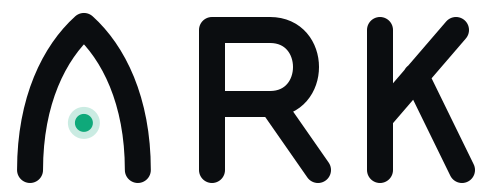
    </picture>
  </a>

<b>Connect any Kafka topic to any HTTP app. No Kafka client code. Nothing lost.</b>

  <a href="https://github.com/raven-clown/ark">Repository</a> ·
  <a href="https://raven-clown.github.io/ark/">Website</a> ·
  <a href="./experience/side-projects#ark">Write-up</a>

  <picture>
    <source media="(prefers-color-scheme: dark)" srcset="./assets/ark/ark-flow-dark.svg">
    
  </picture>

A self-hosted bridge between Kafka and the HTTP services a team already has, built solo from an empty repo. ARK consumes each message, validates it, calls the app, and produces the answer to another topic, with retries, per-key ordering, dead letters and a circuit breaker built in. When one path isn't enough, a pipeline becomes a flow: conditions anywhere, fan-out to several apps, webhooks and topics, and a line of its own for every answer, reject and failure. One Go binary, one YAML file, and a React console to see and change all of it.

<table>
<tr>
<td width="50%"></td>
<td width="50%"></td>
</tr>
<tr>
<td align="center">Live canvas: every dot is ten real messages</td>
<td align="center">Flow designer with app steps and send patterns</td>
</tr>
<tr>
<td></td>
<td>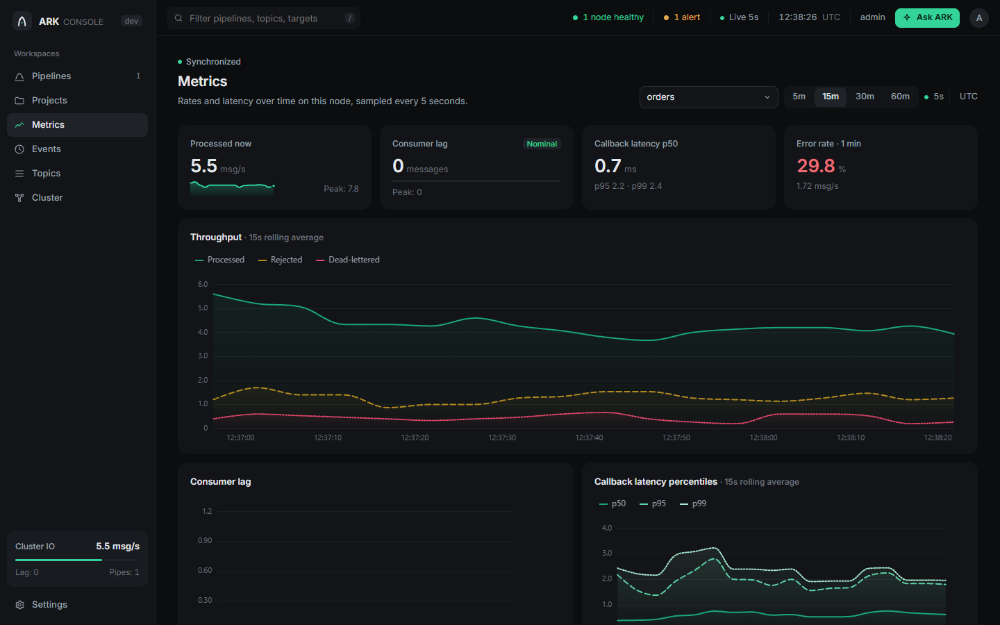</td>
</tr>
<tr>
<td align="center">Health with the reason and the next step</td>
<td align="center">Throughput, lag and latency percentiles</td>
</tr>
</table>

- **Delivery you can trust:** at-least-once with in-order commits, stable correlation IDs, and every failure landing somewhere visible.
- **Flows like a workflow:** a DAG of steps (call, condition, data check, topic, webhook, reject, dead letter) that refuses loops and commits each message once.
- **Talks to the rest of the stack:** ready-made steps for OpenSearch, Elasticsearch, NiFi, another Kafka cluster, Slack, Discord and Teams.
- **Cluster without a new dependency:** leader election, label-based placement and failover coordinated through Kafka itself.
- **Built-in MCP server and assistant:** agents can diagnose a pipeline, explain an error or draft a config change that only applies after a confirmed preview.
- **Checked on every push:** gosec, Semgrep, govulncheck, OSV-Scanner, Gitleaks, Trivy and CodeQL in CI.

---

## About

I'm a junior developer at Delta Electronics Thailand, on the IT manufacturing systems team, where I handle both DevOps and full-stack web development for the factory's MES (Manufacturing Execution System) tooling. I also run my own projects end to end: planning them, building them, presenting them to the team, and supporting the people who use them afterward.

Outside of work, I've spent about five years building and operating multiplayer game-server platforms (FiveM and RedM), which is where most of my backend, database, and systems-architecture experience actually comes from before I ever touched a corporate codebase. I taught myself Lua well enough to write almost anything in it from memory, and that same instinct for "just build the thing and fix what breaks" carried over into everything else here: DevOps, backend APIs, database design, and UI.

This repository is a map of that work. This page is the summary.

| Folder | What's inside |
|---|---|
| [`about/`](./about) | Who I am outside of the job title, how I work, and personal background |
| [`experience/`](./experience) | The portfolio: concrete projects and what came out of them |
| [`brain/`](./brain) | The knowledge base: how each skill area actually works, in detail |

**Education:** B.Sc. Digital Business Technology, Southeast Bangkok University (2025, GPA 3.63, First Class Honors / Gold Medal) · High Vocational Certificate in Information Technology, Attawit Commercial Technology College (2023, GPA 3.10)

**Languages:** Thai (native), English (working proficiency)

 

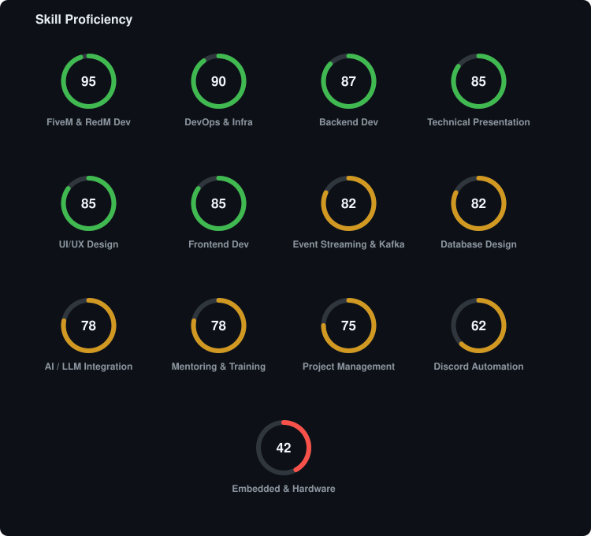

 

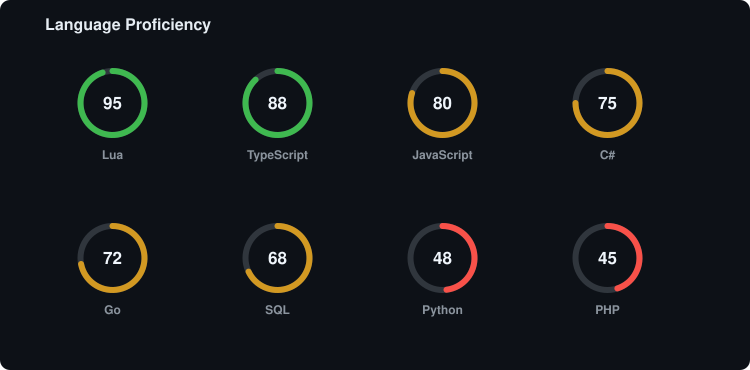

---

## Projects

| Project | What it is |
|---|---|
| [ARK](https://github.com/raven-clown/ark) | Kafka-to-HTTP bridge with flows, a cluster mode, an MCP server and a React console |
| [Delta Electronics](./experience/delta-electronics) | The CI/CD platform, MES dashboards, and diagnostic tools I build and run as my day job |
| [FiveM & RedM Platform](./experience/fivem-redm-platform) | A multiplayer roleplay platform I founded and ran end to end for five years |
| [Side Projects](./experience/side-projects) | [ARK](https://github.com/raven-clown/ark), [RoomedIn](https://www.roomedin.online/), [IdpForge](https://github.com/raven-clown/idpforge), [Vinylcord](https://github.com/raven-clown/vinylcord), [mcp-stdio-debug](https://www.npmjs.com/package/mcp-stdio-debug), a habit-tracking tool, and a code snippet manager |
| [Academic Projects](./experience/academic-projects) | Three projects from vocational and university coursework |

---

## What I Actually Do

Each area below is split two ways. **Knowledge** explains how the technology itself works. **Portfolio** shows what I actually built with it. They're kept separate on purpose: one is reference material, the other is proof of work.

### DevOps & Infrastructure

CI/CD pipelines, Kubernetes/Rancher, Docker, container registries, object storage, and cloud hosting. The plumbing that gets code from a commit to a running service.

Knowledge: [`brain/devops-infrastructure`](./brain/devops-infrastructure) · Portfolio: [`experience/delta-electronics`](./experience/delta-electronics)

### Backend Development

ASP.NET Core, NestJS with Prisma, and Go. How each one structures a request, handles data access, and where they're each the right tool.

Knowledge: [`brain/backend-development`](./brain/backend-development) · Portfolio: [`experience/delta-electronics`](./experience/delta-electronics) · [`experience/side-projects`](./experience/side-projects)

### Event Streaming & Integration

Kafka consumer groups, offsets, rebalances, dead-letter topics, and getting messages into the systems that act on them (HTTP services, OpenSearch, NiFi) without losing or reordering any.

Knowledge: [`brain/side-projects-architecture`](./brain/side-projects-architecture) · Portfolio: [`experience/side-projects`](./experience/side-projects#ark)

### Frontend Development

React, Next.js, Nuxt.js, Vue, and Svelte, plus UX/UI design for real-time interfaces where the UI can't get in the way of what's happening underneath it.

Knowledge: [`brain/frontend-development`](./brain/frontend-development) · Portfolio: [`experience/delta-electronics`](./experience/delta-electronics) · [`experience/fivem-redm-platform`](./experience/fivem-redm-platform) · [`experience/side-projects`](./experience/side-projects)

### Database Design

Oracle, SQL Server, PostgreSQL, MySQL, MongoDB, and Supabase. Relational modeling, indexing, and schema design for both enterprise data and high-write real-time systems.

Knowledge: [`brain/database-design`](./brain/database-design) · Portfolio: [`experience/delta-electronics`](./experience/delta-electronics) · [`experience/fivem-redm-platform`](./experience/fivem-redm-platform) · [`experience/side-projects`](./experience/side-projects)

### FiveM & RedM Development

Five years of building on the FiveM and RedM multiplayer platforms. Server architecture, the Lua resource model, and the ESX/QBCore frameworks that sit underneath most roleplay servers.

Knowledge: [`brain/fivem-redm-development`](./brain/fivem-redm-development) · Portfolio: [`experience/fivem-redm-platform`](./experience/fivem-redm-platform)

### AI / LLM Integration

Retrieval-based systems that ground an LLM's answers in real documents instead of relying on what the model already knows, and MCP servers that let an agent operate a real system within scoped permissions.

Knowledge: [`brain/ai-integration`](./brain/ai-integration) · Portfolio: [`experience/delta-electronics`](./experience/delta-electronics) · [`experience/side-projects`](./experience/side-projects)

### Discord Bots & Automation

Bot architecture, job queues, and the runtimes/libraries that make background automation reliable instead of flaky.

Knowledge: [`brain/discord-bots-automation`](./brain/discord-bots-automation) · Portfolio: [`experience/fivem-redm-platform`](./experience/fivem-redm-platform) · [`experience/side-projects`](./experience/side-projects)

### Embedded & Hardware

Arduino programming, sensor input, and circuit prototyping. Where software meets a physical breadboard.

Knowledge: [`brain/embedded-hardware`](./brain/embedded-hardware) · Portfolio: [`experience/academic-projects`](./experience/academic-projects)

### System Design Patterns

How I approach scoping an architecture to an actual budget, structuring a multi-service system, and deciding what to build versus what to borrow.

Knowledge: [`brain/side-projects-architecture`](./brain/side-projects-architecture) · Portfolio: [`experience/side-projects`](./experience/side-projects)

### Tools & Troubleshooting

Environment debugging, git workflows, and the unglamorous work that has to happen before anything above ships.

Knowledge: [`brain/tools-and-troubleshooting`](./brain/tools-and-troubleshooting)

---

## System Architecture

A few of the systems above, laid out.

### [ARK](https://github.com/raven-clown/ark): From a Topic to Every System That Needs the Message

One engine per node, coordinated through Kafka, with a console and agents on the side.

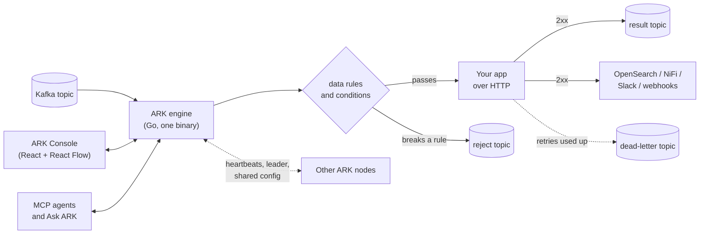
```mermaid
flowchart LR
    Src[("Kafka topic")] --> Engine["ARK engine\n(Go, one binary)"]
    Engine --> Check{"data rules\nand conditions"}
    Check -->|"passes"| App["Your app\nover HTTP"]
    Check -->|"breaks a rule"| Rej[("reject topic")]
    App -->|"2xx"| Res[("result topic")]
    App -->|"2xx"| Out["OpenSearch / NiFi /\nSlack / webhooks"]
    App -.->|"retries used up"| DLQ[("dead-letter topic")]
    Console["ARK Console\n(React + React Flow)"] <--> Engine
    Agents["MCP agents\nand Ask ARK"] <--> Engine
    Engine <-.->|"heartbeats, leader,\nshared config"| Nodes["Other ARK nodes"]
```

### Delta MES: CI/CD and Deployment

How code gets from a commit to a running service inside the air-gapped cluster.

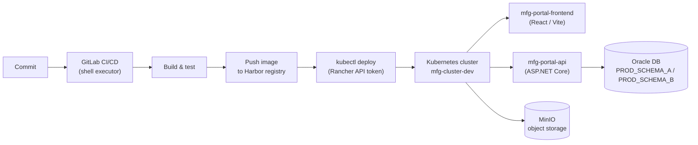
```mermaid
flowchart LR
    Dev["Commit"] --> CI["GitLab CI/CD\n(shell executor)"]
    CI --> Build["Build & test"]
    Build --> Harbor["Push image\nto Harbor registry"]
    Harbor --> Deploy["kubectl deploy\n(Rancher API token)"]
    Deploy --> K8s["Kubernetes cluster\nmfg-cluster-dev"]
    K8s --> FE["mfg-portal-frontend\n(React / Vite)"]
    K8s --> BE["mfg-portal-api\n(ASP.NET Core)"]
    K8s --> MinIO[("MinIO\nobject storage")]
    BE --> Oracle[("Oracle DB\nPROD_SCHEMA_A / PROD_SCHEMA_B")]
```

### Delta MES: CTP Diagnostic Tool, Yield Tracker, and Dashboard

Where the data actually comes from and how it reaches the screen.

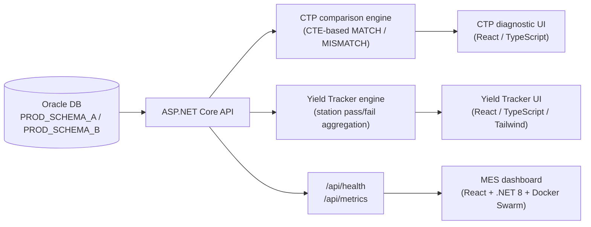
```mermaid
flowchart LR
    Oracle[("Oracle DB\nPROD_SCHEMA_A / PROD_SCHEMA_B")] --> API["ASP.NET Core API"]
    API --> CTP["CTP comparison engine\n(CTE-based MATCH / MISMATCH)"]
    API --> Yield["Yield Tracker engine\n(station pass/fail aggregation)"]
    API --> Metrics["/api/health\n/api/metrics"]
    CTP --> UI1["CTP diagnostic UI\n(React / TypeScript)"]
    Yield --> UI3["Yield Tracker UI\n(React / TypeScript / Tailwind)"]
    Metrics --> UI2["MES dashboard\n(React + .NET 8 + Docker Swarm)"]
```

### FiveM Server Platform

Server, systems, and the storefront running alongside it.

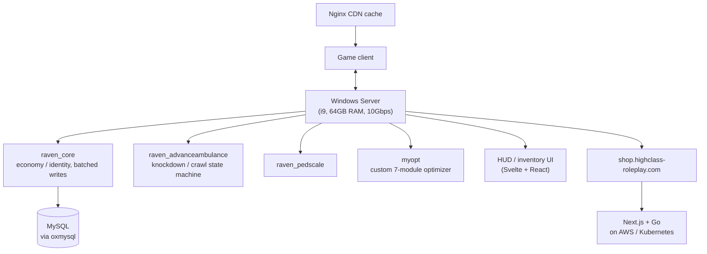
```mermaid
flowchart TB
    Client["Game client"] <--> Server["Windows Server\n(i9, 64GB RAM, 10Gbps)"]
    Nginx["Nginx CDN cache"] --> Client
    Server --> Core["raven_core\neconomy / identity, batched writes"]
    Server --> Medical["raven_advanceambulance\nknockdown / crawl state machine"]
    Server --> Pedscale["raven_pedscale"]
    Server --> Opt["myopt\ncustom 7-module optimizer"]
    Core --> DB[("MySQL\nvia oxmysql")]
    Server --> UI["HUD / inventory UI\n(Svelte + React)"]
    Server --> Shop["shop.highclass-roleplay.com"]
    Shop --> Cloud["Next.js + Go\non AWS / Kubernetes"]
```

### [IdpForge](https://github.com/raven-clown/idpforge): Cluster-Safe Background Jobs and Realtime Fan-Out

How one binary stays correct whether it's a single instance or several behind a load balancer.

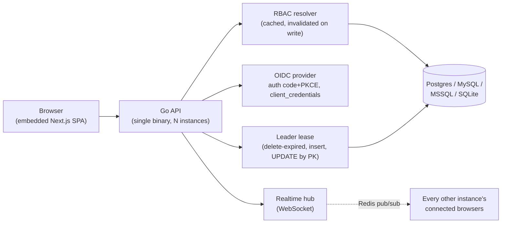
```mermaid
flowchart LR
    Browser["Browser\n(embedded Next.js SPA)"] --> API["Go API\n(single binary, N instances)"]
    API --> RBAC["RBAC resolver\n(cached, invalidated on write)"]
    API --> OIDC["OIDC provider\nauth code+PKCE, client_credentials"]
    API --> Hub["Realtime hub\n(WebSocket)"]
    API --> Lease["Leader lease\n(delete-expired, insert, UPDATE by PK)"]
    RBAC --> DB[("Postgres / MySQL /\nMSSQL / SQLite")]
    Lease --> DB
    Hub -. "Redis pub/sub" .-> Other["Every other instance's\nconnected browsers"]
```

### Snippet Manager: Two Front-Ends, One Core

How the VS Code extension and the Electron app share state without a server.

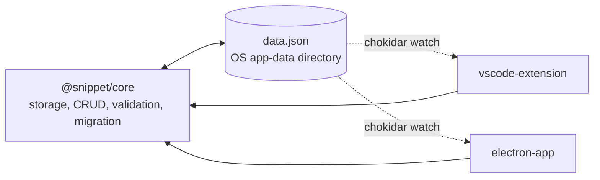
```mermaid
flowchart LR
    Core["@snippet/core\nstorage, CRUD, validation, migration"]
    Core <--> DataFile[("data.json\nOS app-data directory")]
    VSC["vscode-extension"] --> Core
    Electron["electron-app"] --> Core
    DataFile -. "chokidar watch" .-> VSC
    DataFile -. "chokidar watch" .-> Electron
```

### [RoomedIn](https://www.roomedin.online/): Defense in Depth on a Status Change

Five independent layers between a tap on a phone and a row actually changing.

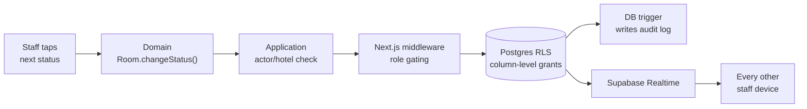
```mermaid
flowchart LR
    UI["Staff taps\nnext status"] --> Domain["Domain\nRoom.changeStatus()"]
    Domain --> App["Application\nactor/hotel check"]
    App --> MW["Next.js middleware\nrole gating"]
    MW --> RLS[("Postgres RLS\ncolumn-level grants")]
    RLS --> Trigger["DB trigger\nwrites audit log"]
    RLS --> Realtime["Supabase Realtime"]
    Realtime --> Board["Every other\nstaff device"]
```

---

## Core Stack

| Area | Tools |
|---|---|
| **Languages** | C#, TypeScript, JavaScript, Python, Java, PHP, Go, Lua, SQL |
| **Frameworks** | React, Next.js, Nuxt.js, Vue.js, Svelte, Electron, ASP.NET Core (.NET 8), Express.js, NestJS |
| **Infrastructure** | GitLab CI/CD, GitHub Actions, Docker, Docker Swarm, Kubernetes (Rancher), Harbor Registry, GitHub Container Registry, AWS, Vercel, MinIO, Redis, Kong, Prometheus, Grafana |
| **Streaming & Integration** | Kafka (KRaft, consumer groups, compacted topics), AKHQ, Apache NiFi, OpenSearch |
| **Databases** | Oracle, Microsoft SQL Server, PostgreSQL, MySQL, MongoDB, Supabase |
| **AI** | MCP servers, retrieval-based LLM systems, OpenAI-compatible and local models |
| **Data** | Power BI, machine learning fundamentals |
| **Other** | LINE Bot/OA API, Figma, Arduino and embedded systems, Cisco networking, Adobe Photoshop/Illustrator, Linux (RHEL), Visual Studio, VS Code |

---

## Contact

- Email: ekdanai.kk@gmail.com
- GitHub: [raven-clown](https://github.com/raven-clown)
