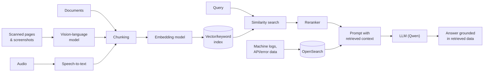

# AI / LLM Integration

How a retrieval-based LLM system actually works, point by point.

## Architecture: Retrieval Across Input Types

## Retrieval-Augmented Generation (RAG)

- The core problem RAG solves: an LLM only knows what was in its training data, so it can't answer questions about internal, private, or recently-changed documents on its own. RAG fixes that by fetching the relevant text at query time and handing it to the model as context, instead of relying on what the model already "knows."
- Documents are split into chunks ahead of time (chunking), small enough that each chunk is focused and fits comfortably in a prompt, large enough that each chunk still makes sense on its own without surrounding context.
- At query time: the incoming question is used to find the most relevant chunks, those chunks get inserted into the prompt alongside the question, and the LLM generates an answer grounded in that retrieved text rather than purely from memory.

## Why Chunking Strategy Matters

- Chunk size is a trade-off. Too small and a chunk loses context (a sentence fragment without the surrounding paragraph can be ambiguous); too large and irrelevant text gets pulled in alongside the useful part, diluting what the model actually needs to answer well.
- Overlap between consecutive chunks helps avoid losing information that sits right at a chunk boundary.

## Working Without a Managed Vector Database

- A typical RAG stack leans on a vector database for similarity search, but that's not always available, for example inside a network with no access to external managed services. In that situation, retrieval has to be built on whatever's available locally (a self-hosted search index, or a simpler keyword/embedding lookup), which means understanding the retrieval step well enough to implement it directly rather than configuring an off-the-shelf service.

## Calling the LLM

- Once relevant chunks are retrieved, they're combined with the user's question into a single prompt sent to the model through its API. How clearly the retrieved context is separated from the instructions has a real effect on answer quality, independent of which model is behind the API.

## Applied To Internal Knowledge Search

Built an internal document search tool using this pattern end to end: documents chunked ahead of time, a query-time retrieval step, and the Qwen API as the underlying LLM answering from whatever was retrieved. Full context in [`experience/delta-electronics`](../../experience/delta-electronics).

## Beyond Plain RAG: Reranking, Vision, and Embeddings

- Reranking. A first-pass retrieval step over-fetches candidate chunks by similarity search alone, which is fast but not precise. A reranker model scores that candidate set against the query more carefully and reorders it, so the chunks that actually go into the prompt are the most relevant ones, not just the ones that happened to score well on a cheaper first pass.
- Vision-language models (VLMs). Used for documents where the useful content isn't plain text, reading text and layout directly out of scanned pages, screenshots, and diagrams instead of requiring a separate OCR step first.
- Embedding models. The similarity-search step underneath both plain retrieval and reranking depends on an embedding model turning text (and, for VLM use cases, images) into vectors that can be compared for closeness. Qwen's embedding models are used for this alongside its LLM API.
- Speech-to-text. A speech-to-text model is used where the source material is audio rather than text, transcribing it first so it can go through the same chunking and retrieval pipeline as everything else.

## Log and Error Data as Training/Fine-Tuning Input

Machine logs, internal API responses, and error output from the factory floor are a different kind of input from documents: high-volume, structured or semi-structured, and continuously produced. Used as fine-tuning input for smaller models trained to work with that data directly, rather than only routing everything through a general-purpose LLM prompt. Logs are indexed into OpenSearch, with retrieval over that index used to ground answers about what a machine or service actually did, the same "ground answers in retrieved data instead of memory" principle as the document RAG case above, applied to operational data instead of static documents.
