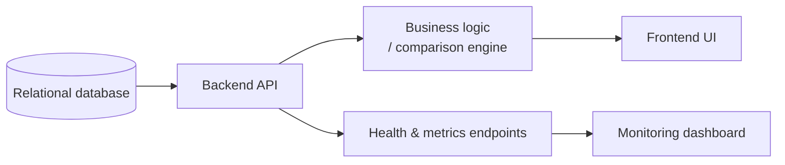

# Backend Development

How the frameworks I use most actually work, point by point.

## Architecture — A Typical Request Flow

## ASP.NET Core

- Cross-platform, open-source web framework from Microsoft, built on .NET — the same framework runs across different operating systems and hosting environments.
- Every request passes through a middleware pipeline configured in the app's startup code: routing, authentication, exception handling, and custom middleware each get a chance to inspect or short-circuit the request in order.
- Dependency injection is built into the framework itself, not bolted on — services are registered with a lifetime (Scoped, Transient, or Singleton) and the framework hands them to controllers automatically instead of controllers constructing their own dependencies.
- Kestrel is the built-in web server; in production it typically sits behind a reverse proxy (nginx or a cloud load balancer) that handles TLS termination and forwards traffic to Kestrel.
- Data access is usually through an ORM (Entity Framework Core) for typical CRUD work, or raw ADO.NET/parameterized queries when a query needs to be hand-tuned — for example, a comparison across two large tables where an ORM-generated query would be too slow or too hard to reason about.

## NestJS + Prisma

- NestJS structures an application into modules, each containing controllers (handle incoming HTTP routes) and providers/services (hold the actual business logic) — the architecture is explicitly modeled on Angular, using decorators and a dependency injection container.
- A request flow looks like: controller receives the HTTP call → delegates to a service → service calls Prisma → Prisma returns typed data → service returns a DTO → controller sends the response.
- Prisma is a schema-first ORM: you define your data model once in a `schema.prisma` file, and Prisma generates a fully-typed client from it, so a typo in a field name fails at compile time instead of at runtime.
- Migrations are tracked as versioned files generated by the Prisma CLI, which keeps the database schema and the application's model of that schema from drifting apart.

## Go

- Compiled and statically typed, and it produces a single self-contained binary — no separate runtime has to be installed on the machine it runs on, which makes it a clean fit for containers.
- Concurrency is a first-class language feature: goroutines are lightweight threads managed by the Go runtime, and channels are the built-in way for them to communicate safely instead of sharing memory directly.
- There's no class-based inheritance — behavior is composed through interfaces (a type "satisfies" an interface just by implementing its methods, no explicit declaration needed) and struct embedding instead.
- The combination of fast startup, low memory footprint, and a single binary is why it's a good fit for a lightweight API gateway or a small service that needs to start fast and stay lean under load.

## Working With C#

- Can read C# fluently and follow what a piece of code is doing, but writing it from scratch without a reference takes longer — the syntax doesn't stick the way a language used daily does. Lua, by contrast, is fully unaided (see [fivem-redm-development](../fivem-redm-development)) — the difference is really just hours logged in each one.

## Python

- Image processing and conversion: reading images with a library like Pillow, then transforming them — resizing, reformatting, batch-converting file types — programmatically instead of one file at a time by hand.
- Data and image scraping: pulling structured data or images from a source with a script instead of collecting it manually, the same instinct as everything else here — automate the repetitive part.
- APIs: building lightweight HTTP APIs in Python when a task doesn't need the full weight of the ASP.NET Core/NestJS stack above.

## SQL

- Comfortable with the basics across Oracle, SQL Server, MySQL, and PostgreSQL — SELECT/WHERE/GROUP BY, aggregate functions, and reading an existing query well enough to know what it's doing.
- Common Table Expressions (CTEs) are useful for breaking a complex comparison into named, readable steps — for example, matching records between two tables on a shared key and labeling each row as a match or mismatch, instead of writing one large nested subquery.
- Multi-table JOINs beyond two or three tables are still a growth area — an active work-in-progress rather than a strength yet.
