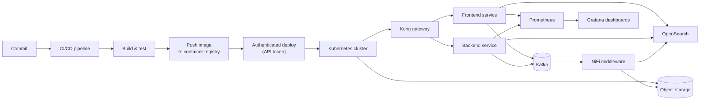

# DevOps & Infrastructure

How the pieces of a CI/CD and deployment stack work, and how they fit together.

## Architecture: A Typical Pipeline

## GitLab CI/CD

- A pipeline is defined in a `.gitlab-ci.yml` file and runs as a sequence of stages, typically build, test, then deploy, where each stage only starts once the previous one passes.
- A runner (the "executor") is the machine that actually executes each job. A shell executor runs jobs directly on the host's shell instead of spinning up a fresh container per job. Faster to configure, but the environment has to be kept clean manually since it isn't reset between runs.
- Deployment jobs authenticate against a target cluster using a scoped API token rather than a personal login, so access can be revoked or rotated without touching anyone's individual credentials.
- Artifacts (build output, test reports) can be passed between stages so a later job doesn't have to rebuild what an earlier one already produced.

## Kubernetes & Rancher

- Kubernetes schedules containers ("pods") across a cluster of machines, and keeps the actual state matching whatever you declared. A Deployment says "I want 3 replicas of this pod running," and Kubernetes keeps making that true.
- Namespaces partition a cluster into logical environments (dev, QA, prod, or per-team) that share the underlying hardware but stay isolated from each other for access control and resource limits.
- Rancher sits on top of raw Kubernetes as a management layer: one UI/API for multiple clusters, centralized RBAC, and easier day-to-day operations than talking to each cluster's API directly.
- A push-based deploy (`kubectl apply` from CI, authenticated with an API token) is simpler to set up than a pull-based GitOps model, at the cost of the cluster having to trust an external system to push changes to it.
- Ingress controllers handle routing external traffic into the right service inside the cluster based on hostname/path rules, instead of exposing every service on its own IP or port.
- A Horizontal Pod Autoscaler (HPA) scales replica count based on load, but it's still bound by whatever ResourceQuota is set on the namespace. If the quota is maxed out, the HPA can be "correctly" trying to scale up and still get blocked.

## Docker & Docker Swarm

- An image is built in layers; BuildKit (Docker's newer build engine) caches those layers intelligently so unchanged layers don't get rebuilt on every run.
- Tagging images with the commit SHA instead of a static tag like `latest` means every deployed image is traceable back to the exact commit that produced it. Useful when something breaks and you need to know exactly what's running.
- Docker Swarm is a simpler orchestrator than Kubernetes: fewer moving parts, easier to reason about for smaller deployments, at the cost of a smaller feature set (no equivalent to Kubernetes' Ingress/HPA ecosystem out of the box).

## Harbor (Container Registry)

- A private registry stores built images so they don't have to be pulled from a public registry. Important in restricted network environments, and it gives you control over retention and vulnerability scanning.
- Base images (like `nginx:alpine`) need to be deliberately preserved/pinned in a private registry, or a routine cleanup policy can delete an image that's still in active use by a running deployment.

## Apache Kafka

- A distributed event log: producers publish messages to a topic, and consumers read from it independently, decoupled in time from whoever produced the message. A service doesn't need to know who's listening, or whether they're even online yet, to publish an event.
- Topics are partitioned and replicated across brokers, which is what makes Kafka handle high-throughput streams (service events, logs, metrics) without a single broker becoming the bottleneck, and survive a broker going down without losing data.
- A natural fit as the backbone in front of NiFi and the observability stack: services publish events once, and NiFi, log indexing, and any other consumer each read from the same topic independently instead of every service needing its own point-to-point integration with every downstream system.
- AKHQ is the operational view into a running cluster: browsing topics, inspecting individual messages, watching consumer group lag, and managing ACLs and schemas from a UI instead of the Kafka CLI tools.

## Kong (API Gateway)

- Sits in front of backend services as a single entry point, handling routing, authentication, rate limiting, and request/response transformation in one place instead of every service reimplementing the same cross-cutting concerns.
- Plugin-based: auth, rate limiting, logging, and transformations are each a plugin attached to a route or service, so the gateway's behavior is configuration rather than custom code for common concerns.
- Centralizing this at the gateway means a policy change (a new rate limit, a new auth requirement) is one configuration change instead of a code change and redeploy in every service that needs it.

## Apache NiFi

- A dataflow automation tool built around a visual pipeline: each step (a "processor") reads, transforms, routes, or writes data, and processors are wired together into a flow instead of hand-writing point-to-point integration scripts.
- Works well as a general middleware layer. Logging, alerting, data migration, and routing data between systems can all live as flows in the same tool, so a new integration is usually a new flow rather than a new one-off script.
- Flows are visual and inspectable at runtime. A stuck or failing step shows up directly in the flow itself, which makes tracing where a pipeline broke faster than digging through separate log files for each system it touches.

## Observability: Metrics and Logs

- Prometheus scrapes metrics from each service on a pull model: services expose a `/metrics` endpoint, and Prometheus polls it on an interval, rather than each service pushing metrics out to a collector. That makes adding a new service to monitor a matter of pointing Prometheus at it, not changing the service's own code to push somewhere new.
- Grafana sits on top of Prometheus (and other data sources) as the dashboard and alerting layer, turning raw time-series metrics into panels people actually look at day to day.
- OpenSearch centralizes logs from multiple services into one searchable index instead of SSH-ing into individual machines to `tail` separate log files. That same index is also what a retrieval step can query when an AI system needs to answer "what did this service actually do," grounding the answer in real log data instead of a guess.
- Metrics answer "is something wrong," logs answer "what exactly happened." Keeping both in place from early on means a failure gets diagnosed from data that already exists instead of needing to reproduce it live.

## MinIO (Object Storage)

- An S3-compatible object store: same API shape as AWS S3, but self-hosted. Anything already written against the S3 SDK works against it with just an endpoint change.
- Organized into buckets with their own access policies, which makes it a natural drop point for pipeline artifacts, backups, or files that a batch job needs to pick up and process.

## AWS

- Running a Kubernetes cluster on cloud infrastructure means the control plane and worker nodes are cloud-managed resources instead of physical machines, which makes scaling a capacity decision instead of a hardware-ordering one.
- A typical setup: a load balancer or CDN in front, SSL terminated at the edge, then traffic routed back into the cluster.

## Secrets Management

- Symmetric encryption (AES-256-CBC) is a reasonable way to store secrets in a config file that has to live in a repo. The encrypted value is safe to commit, and only something holding the key can decrypt it back.
- If a real secret ever lands in git history unencrypted, rotating the secret alone isn't enough. The history itself has to be rewritten (with a tool like `git filter-repo`) or the old value stays recoverable by anyone who already has a clone.
