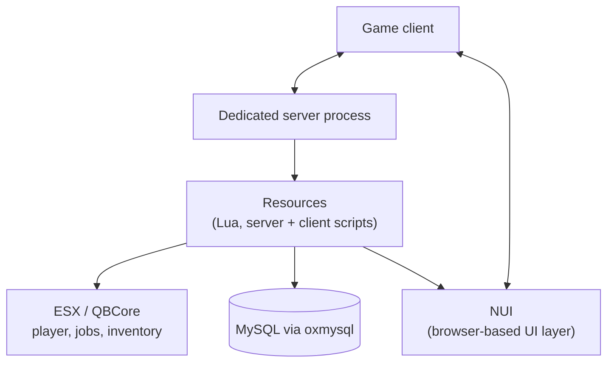

# FiveM & RedM Development

How the platform itself works, underneath any specific server built on it.

## Architecture: Platform Overview

## Client-Server Architecture

- Both FiveM and RedM run a dedicated server process that all players connect to; the server is the authority on game state, and the client is mostly a renderer that sends inputs and receives state updates.
- Server-side code and client-side code are explicitly separate. A script has to declare whether it runs on the server, the client, or both, and the two sides communicate through a defined event system rather than sharing memory directly.

## Resources

- A "resource" is the platform's unit of deployable code: a folder with a manifest file (`fxmanifest.lua`) declaring its scripts, dependencies, and version, plus the actual Lua (or C#/JS) files that implement it.
- Resources are started and stopped independently by the server, which makes it possible to update or restart one system without taking down the whole server.
- Events are the primary communication mechanism: a resource can trigger a named event with a payload, and any other resource (or the client) listening for that event name receives it. A loosely coupled way for otherwise-independent resources to talk to each other.

## ESX / QBCore Frameworks

- Both are community frameworks that provide the scaffolding a roleplay server needs out of the box: player identity, jobs, inventory, money, and a shared data layer, so a new resource can hook into "the player's inventory" or "the player's job" instead of reinventing that system from scratch.
- They differ mainly in structure and convention (QBCore leans more modular/event-driven, ESX has a longer legacy codebase with more third-party resources built against it), but both expose a similar shape: framework-level player object, framework-level events, and a shared database layer underneath.
- Building a custom resource against either framework means working within its conventions for registering jobs, items, and events, so it stays compatible with everything else already running on top of the same framework.

## NUI (In-Game UI)

- NUI is a Chromium-based browser layer rendered on top of the game. Any web frontend (HTML/CSS/JS, or a framework like Svelte/React compiled down to static assets) can be loaded into it.
- Communication between the game (Lua) and the NUI layer happens through a message-passing bridge. Lua sends data to the browser layer, and the browser layer posts events back, similar in shape to how a native app talks to an embedded webview.

## Community Libraries (oxmysql / ox_lib)

- `oxmysql` is an async MySQL wrapper. Database calls from Lua don't block the main thread while waiting on a query, which matters on a server handling many concurrent players hitting the database at once.
- `ox_lib` is a shared utility library. Common patterns (input dialogs, notifications, callback handling) implemented once and reused across resources instead of every resource rolling its own version.

## RedM

- Built on the same underlying engine family as FiveM, adapted for Red Dead Redemption 2. The resource system, Lua scripting model, and client/server split carry over directly, with game-specific differences in the available natives (the engine-level functions a script can call) and the assets available to build UI and animations around.
