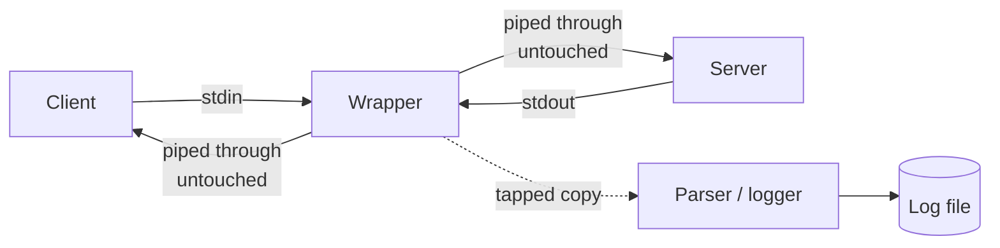

# System Design Patterns

General principles I default to when scoping and designing a new system, independent of any one project.

## Scoping to an Actual Budget

- Design the "correct" architecture first, the one you'd build with an unlimited budget and a team, then deliberately re-scope it against what the project can actually afford to run.
- A managed multi-service cluster (like a Kubernetes-based microservice setup) is the right call at a certain scale, but for a project with no funding and no users yet, a single VPS running everything through Docker Compose is often the more honest choice: same containers, same code, far less operational overhead and cost.
- The scoped-down version should still be a clean upgrade path to the "correct" version later. The goal is to defer complexity, not to design something that has to be thrown away when the project actually grows.
- Before building a paid feature (billing, a payment gateway integration), validate that people actually want it with the cheapest possible version first, even a manual one. A trial-and-manual-transfer billing flow proves demand before it's worth the engineering time of wiring up a real payment provider.

## Structuring a Multi-Service System

- Split services by responsibility, not by technology. A service boundary should represent a real business capability (auth, billing, content) rather than "the Go part" and "the TypeScript part."
- Design the data model and the auth/permission layer early and deliberately, since both are expensive to change later once other services depend on their shape.
- Document decisions before writing production code. A handful of markdown docs covering the schema, the roadmap, and the trade-offs considered is cheap up front and saves re-deriving the same reasoning later.

## Build vs. Borrow

- Default to an existing library or managed service for anything that isn't the actual point of the project. Auth, caching, and job queues are solved problems; time is better spent on whatever makes the project distinct.
- Reach for a custom-built solution when the off-the-shelf option is actually the bottleneck, either because it's opaque (can't be debugged when it breaks) or because it doesn't fit the specific performance/behavior the project needs.

## Observability From the Start

- Health and metrics endpoints, structured logging, and rate limiting are easier to build in from day one than to retrofit once a system already has real traffic and real failure modes to account for.

## Access Control Without a Master Credential

- When a feature needs to bypass row-level security for a legitimate reason (cross-tenant admin stats, a platform-wide report), gate it with a narrow, internally-checked database function instead of introducing a service-role or admin credential into the application. A leaked or misused function call is scoped to what that function does; a leaked master credential bypasses everything.
- A boolean-returning permission check has to treat an unexpected null as "deny," not "allow." In PL/pgSQL specifically, `if not some_check()` fails open when the check returns null instead of a real boolean, since a null condition is treated as false and the branch is silently skipped. Writing it as `if some_check() is not true` closes that gap.

## Tapping a Stream Without Touching It

- When a tool has to sit between two things that already have a working protocol (a client and a server talking stdio JSON-RPC, for example), the transport itself is off-limits: anything the wrapper writes into that channel corrupts it for both sides.
- The fix is to relay the transport stream byte-for-byte, unmodified, and tap a second copy of the same data for parsing, logging, or metrics, rather than trying to intercept and reconstruct it.
- A single `pipe()` from source to destination handles backpressure automatically; writing to the destination manually and separately does not, and a slow downstream consumer can make the wrapper's own memory usage grow without bound.

## Shared Core Across Multiple Runtimes

- When two different front-ends need to operate on the same data (e.g. a VS Code extension and an Electron app), put all storage, validation, and migration logic in one shared package and let both front-ends depend on it. Neither one should touch the filesystem or the data model directly. This keeps the read/write/validate logic in exactly one place instead of drifting between two implementations.
- Real-time sync between independent processes doesn't need a server or IPC if they already share a filesystem. Watching a common data file (chokidar or equivalent) and reacting to change events is enough, and it's simpler to reason about than a message bus for something this small.
- Schema migrations need to be backward-compatible from day one in this kind of setup, since there's no central database to run a one-time migration against. Each client migrates whatever version of the data it opens, on open.
