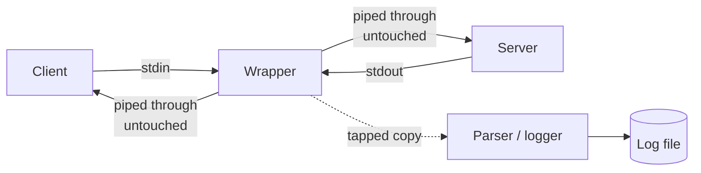
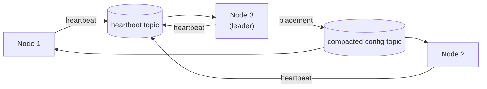

# System Design Patterns

General principles I default to when scoping and designing a new system, independent of any one project.

## Scoping to an Actual Budget

- Design the "correct" architecture first, the one you'd build with an unlimited budget and a team, then deliberately re-scope it against what the project can actually afford to run.
- A managed multi-service cluster (like a Kubernetes-based microservice setup) is the right call at a certain scale, but for a project with no funding and no users yet, a single VPS running everything through Docker Compose is often the more honest choice: same containers, same code, far less operational overhead and cost.
- The scoped-down version should still be a clean upgrade path to the "correct" version later. The goal is to defer complexity, not to design something that has to be thrown away when the project actually grows.
- Before building a paid feature (billing, a payment gateway integration), validate that people actually want it with the cheapest possible version first, even a manual one. A trial-and-manual-transfer billing flow proves demand before it's worth the engineering time of wiring up a real payment provider.

## Structuring a Multi-Service System

- Split services by responsibility, not by technology. A service boundary should represent a real business capability (auth, billing, content) rather than "the Go part" and "the TypeScript part."
- Design the data model and the auth/permission layer early and deliberately, since both are expensive to change later once other services depend on their shape.
- Document decisions before writing production code. A handful of markdown docs covering the schema, the roadmap, and the trade-offs considered is cheap up front and saves re-deriving the same reasoning later.

## Build vs. Borrow

- Default to an existing library or managed service for anything that isn't the actual point of the project. Auth, caching, and job queues are solved problems; time is better spent on whatever makes the project distinct.
- Reach for a custom-built solution when the off-the-shelf option is actually the bottleneck, either because it's opaque (can't be debugged when it breaks) or because it doesn't fit the specific performance/behavior the project needs.

## Observability From the Start

- Health and metrics endpoints, structured logging, and rate limiting are easier to build in from day one than to retrofit once a system already has real traffic and real failure modes to account for.

## Access Control Without a Master Credential

- When a feature needs to bypass row-level security for a legitimate reason (cross-tenant admin stats, a platform-wide report), gate it with a narrow, internally-checked database function instead of introducing a service-role or admin credential into the application. A leaked or misused function call is scoped to what that function does; a leaked master credential bypasses everything.
- A boolean-returning permission check has to treat an unexpected null as "deny," not "allow." In PL/pgSQL specifically, `if not some_check()` fails open when the check returns null instead of a real boolean, since a null condition is treated as false and the branch is silently skipped. Writing it as `if some_check() is not true` closes that gap.

## Tapping a Stream Without Touching It

- When a tool has to sit between two things that already have a working protocol (a client and a server talking stdio JSON-RPC, for example), the transport itself is off-limits: anything the wrapper writes into that channel corrupts it for both sides.
- The fix is to relay the transport stream byte-for-byte, unmodified, and tap a second copy of the same data for parsing, logging, or metrics, rather than trying to intercept and reconstruct it.
- A single `pipe()` from source to destination handles backpressure automatically; writing to the destination manually and separately does not, and a slow downstream consumer can make the wrapper's own memory usage grow without bound.

```mermaid
flowchart LR
    Client["Client"] -->|"stdin"| Wrapper["Wrapper"]
    Wrapper -->|"piped through\nuntouched"| Server["Server"]
    Server -->|"stdout"| Wrapper
    Wrapper -->|"piped through\nuntouched"| Client
    Wrapper -.->|"tapped copy"| Parser["Parser / logger"]
    Parser --> Log[("Log file")]
```

## Shared Core Across Multiple Runtimes

- When two different front-ends need to operate on the same data (e.g. a VS Code extension and an Electron app), put all storage, validation, and migration logic in one shared package and let both front-ends depend on it. Neither one should touch the filesystem or the data model directly. This keeps the read/write/validate logic in exactly one place instead of drifting between two implementations.
- Real-time sync between independent processes doesn't need a server or IPC if they already share a filesystem. Watching a common data file (chokidar or equivalent) and reacting to change events is enough, and it's simpler to reason about than a message bus for something this small.
- Schema migrations need to be backward-compatible from day one in this kind of setup, since there's no central database to run a one-time migration against. Each client migrates whatever version of the data it opens, on open.

## Committing a Stream Without Losing or Skipping Anything

- With Kafka, "processed" has to mean "its result is safely somewhere," not "a worker picked it up." Commit an offset only after the result (or the dead-letter copy) has been produced, and commit in order: a message that can't finish yet holds back the commits behind it on its partition instead of being skipped, so a crash can only cause a redelivery, never a gap.
- Parallelism and ordering aren't opposites. Messages with the same key go one at a time and in order while different keys run side by side, which keeps most of the throughput without letting a customer's second order overtake their first.
- A stable correlation ID derived from topic, partition and offset turns at-least-once into effectively-once for any downstream service willing to use it as an idempotency key, since a retry or a redelivery after a crash carries the same ID.
- Classify failures instead of retrying everything: a 4xx means the message is the problem (reject it with the reason, no retry), 408/425/429 mean "later" (wait, honoring `Retry-After`, without spending a retry), and 5xx or a timeout means the service is the problem (retry with backoff, then dead-letter). Count a message's repeated failures once, or a handful of poison messages will trip a circuit breaker for everyone.

## Coordinating Through What You Already Run

- A clustered service doesn't automatically need etcd or ZooKeeper. If every node already talks to a system with durable, ordered logs, that system can carry heartbeats, leader election and shared config: a compacted topic keyed by pipeline name is a config store, and the latest heartbeat per node is a membership list.
- Keep a node useful when coordination is slow: every node keeps serving what it already runs, and only placement decisions wait for the leader.
- A service started before its dependency should wait for it, with backoff, rather than exit on the first failed connection and stay down after a host restart.

```mermaid
flowchart LR
    N1["Node 1"] -->|"heartbeat"| HB[("heartbeat topic")]
    N2["Node 2"] -->|"heartbeat"| HB
    N3["Node 3\n(leader)"] -->|"heartbeat"| HB
    HB --> N3
    N3 -->|"placement"| Cfg[("compacted config topic")]
    Cfg --> N1
    Cfg --> N2
```

## Letting an Agent Operate a Real System

- Give an agent the same tools a human operator has, but make every permission a ceiling that stacks: the token's scope, a per-resource limit, and a per-project limit, with the lowest one winning.
- Never let a model apply a change in one step. A write returns a preview and a diff plus a one-time confirm token bound to the caller, and only a second call with that token applies it, so a human sees exactly what will change first.
- Small local models follow instructions loosely, so anything that must hold (permissions, the confirm step, which tools exist) belongs in code the model can't talk its way around, not in the prompt.
