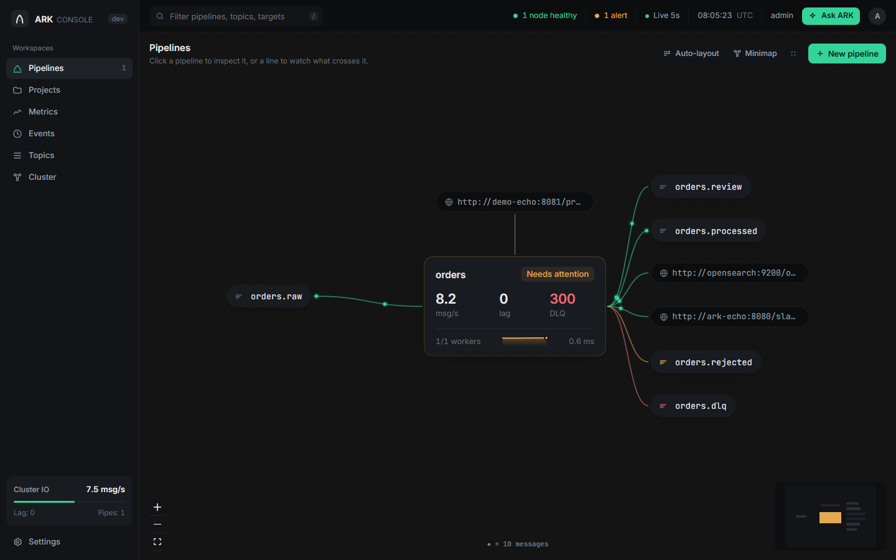
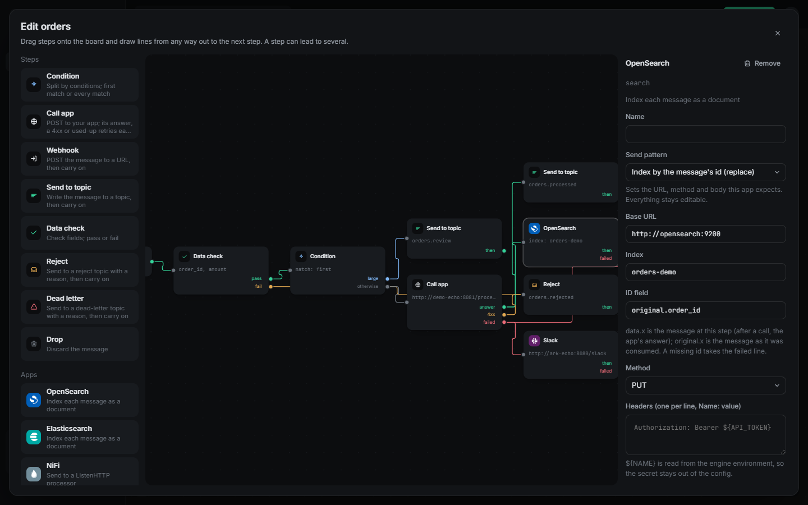
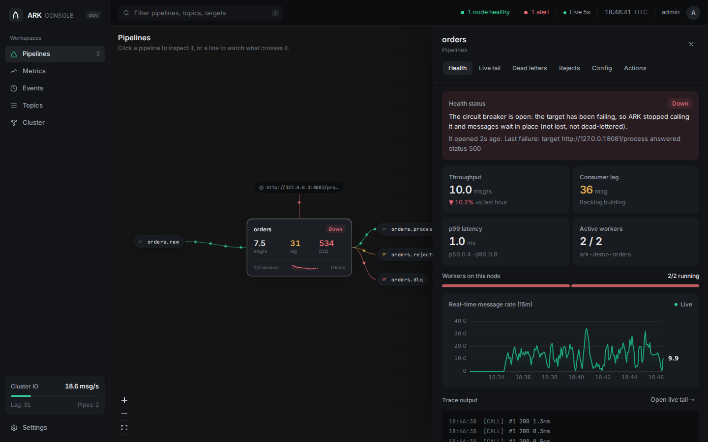
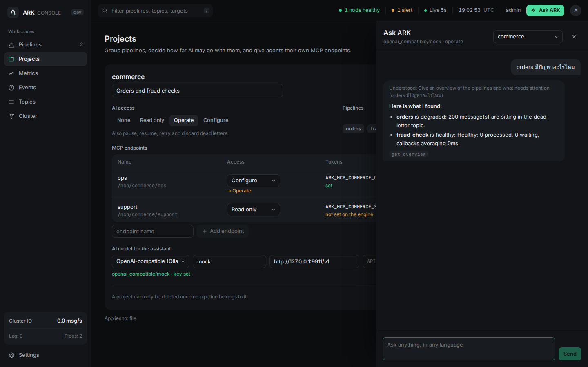

# Side Projects

## [ARK](https://github.com/raven-clown/ark)

  <picture>
    <source media="(prefers-color-scheme: dark)" srcset="../../assets/ark/ark-flow-dark.svg">
    
  </picture>

A config-driven bridge between Kafka and plain HTTP services, built solo from an empty repo: it consumes each message, validates it, calls the app, and produces the answer to another topic, so the app never touches a consumer group, an offset or a rebalance. One Go binary and one YAML file, with a separate React console, a public [website](https://raven-clown.github.io/ark/), and Apache 2.0 licensing. Delivery is at-least-once with in-order commits: an offset is committed only after its result is produced, and a message that can't finish blocks the commits behind it on its partition instead of being skipped. Status codes carry meaning: 4xx goes to a reject topic with the reason, 408/425/429 wait (honoring `Retry-After`) without spending a retry, 5xx retries with backoff and then dead-letters, and a circuit breaker with health probes holds messages in Kafka while the app is down.

When one path isn't enough, a pipeline becomes a flow: a DAG of steps (call an app, condition, data check, topic, webhook, reject, dead letter, drop) where any step can fan out to several others and every answer, reject and failure has a line of its own. Loops are refused at validation, and a message is committed once every path it took is done and counted once however many ways it went. Ready-made app steps send to OpenSearch, Elasticsearch, NiFi, another Kafka cluster, Slack, Discord and Microsoft Teams, each with send patterns that fit the product (index by id, partial update with upsert, Block Kit cards, PUT by id), URL and body templates, and secrets read from the environment. A URL template can only fill in the path or query after `http(s)://host/`, so a message can never change where a request goes.

Cluster mode adds no new dependency: nodes coordinate through Kafka itself, with heartbeats, an elected leader that places workers by label, pipeline config in a compacted topic so a reload on any node reaches all of them, and failover in about a second on a clean stop. An MCP server lets any agent diagnose a pipeline, explain an error, sample odd data, suggest tuning or draft a pipeline, and every config change is a preview and a diff first, applied only with a confirm token. Access is layered: an API or MCP token's scope, each pipeline's `mcp_access`, and each project's `ai_access` are all ceilings, and per-project MCP endpoints get their own tokens. The console's Ask ARK panel uses the same tools with any model (Anthropic, OpenAI, Gemini, or anything OpenAI-compatible, local Ollama included), in Thai, English, and simplified and traditional Chinese.

<table>
<tr>
<td width="50%"></td>
<td width="50%"></td>
</tr>
<tr>
<td></td>
<td></td>
</tr>
</table>

Caught and fixed real bugs by testing against real systems rather than trusting unit tests. An "index by the message's id" send pattern looked right in review and passed its tests, but checking the documents in a real OpenSearch showed every one of them stored under `_id: "<nil>"`: after an app call the message at that step is the app's answer, the id field wasn't in it, and the template rendered a missing value as `<nil>`, so each new document silently overwrote the last. The template's `path` function now fails on a missing value, which sends the message down the step's failed line with the reason, and the id field accepts `original.order_id` to read the message as it was consumed. Under a steady 10% of 500s the circuit breaker kept flapping open, because retries of the same failing message each counted as a new failure; a message now counts once. And opening the chat panel blanked the entire console in current Chrome, because a React effect returned `scrollIntoView`'s result, which Chrome now makes a Promise, and React called it as a cleanup function.

The console draws every pipeline, topic and target on a live React Flow canvas where the dots on each line move at the real message rate (one dot per ten messages, more on busy lines), with a right-click menu for everything a pipeline can do, a flow designer that opens a running fixed-path pipeline as the equivalent flow, dead-letter browsing with retry and discard, a rule builder that previews how many recent messages would match, and metrics with latency percentiles. CI runs gosec, Semgrep, govulncheck, OSV-Scanner, Gitleaks, a Trivy image scan and CodeQL on every push.

Stack: Go (kafka-go, expr-lang, the MCP Go SDK, Prometheus client), React 19, React Flow, ECharts, Vite, Docker Compose, GitHub Actions, GitHub Pages.

## [RoomedIn](https://www.roomedin.online/)

A real-time room status board for small hotels/guesthouses, built solo end to end. That includes the architecture, the database, the UI, and the pricing model. Next.js 16 (App Router) on top of Supabase (Postgres, Auth, Realtime, RLS), with a hexagonal/ports architecture even inside a Next.js app: `domain/` and `application/` have zero imports from Next.js, React, or Supabase, enforced by a custom ESLint rule so it stays true as the app grows. Housekeeping changes a room's status from their phone, reception sees it update instantly through Supabase Realtime, no refresh and no separate WebSocket server to run.

Writes go through five independent layers: domain validation, an application-level actor/hotel check, Next.js middleware role gating, Postgres RLS with column-level grants, and a server-side trigger for the audit log. A client bypassing any one layer still can't rename a room, forge who made a change, or touch another hotel's data. Multi-hotel membership is a proper many-to-many join table with per-hotel roles (owner/admin/reception/housekeeping), not a single global role. Cross-tenant admin features, a platform-wide stats dashboard and manual billing tooling, run through `security definer` Postgres functions gated by an internal check. No service-role Supabase key exists anywhere in the app, so there's no single credential that can bypass RLS.

Caught and fixed a real access-control bug during that admin work. Every admin-gated function used `if not is_platform_admin() then raise exception`, which fails open in PL/pgSQL: a null condition in `IF` is treated as false, so the branch is silently skipped, and an unauthenticated caller with `auth.uid()` = null sailed straight through. Found by testing directly against the live database, root-caused with a minimal reproduction, and fixed the same session by switching every check to `is_platform_admin() is not true`, which correctly treats null as deny.

Runs a real, deliberately manual pricing model for a project with zero funding: a 30-day free trial on an account's first hotel only, flat monthly pricing plus a per-room overage rate, and no payment gateway yet. Billing is bank transfer and PromptPay, tracked through a founder-only admin dashboard, on purpose, to validate that people will actually pay before spending engineering time wiring up Omise. Full bilingual Thai/English support through a hand-rolled typed dictionary system instead of a routing-heavy i18n library, since the app has exactly two locales and most of it has no need for locale-prefixed URLs. Only the public marketing pages use those, for SEO. Stack: TypeScript (strict, `noUncheckedIndexedAccess`), Tailwind CSS v4 with shadcn/ui (Base UI primitives), TanStack Query, Zod, React Hook Form, Vitest and Playwright, deployed on Vercel with GitHub Actions CI.

## [IdpForge](https://github.com/raven-clown/idpforge)

A self-hosted enterprise SSO/identity provider, built solo in Go from an empty repo to a tagged v1.0.0 release: RBAC (users through groups with hierarchy through roles through permissions, cached and invalidated on write), a real OIDC provider (`authorization_code` with mandatory PKCE, `refresh_token`, `client_credentials` for service-to-service auth, JWKS, discovery), WebAuthn/FIDO2 and TOTP for MFA, and an async batched audit log. One static binary, no cgo, `go:embed`-ding a Next.js 16 admin console built as a static export, so the whole deployment story on both Linux and Windows is "copy one file." The database layer is fully pluggable, Postgres, MySQL, MSSQL, or SQLite, through dialect-aware SQL rather than an ORM, with per-driver migration sets kept in lockstep across all four.

Every account, new or reset, gets one server-configured default password and is forced to change it on first login, by design: no endpoint anywhere accepts a caller-chosen password for someone else, and none ever returns one, so there's no path for an admin console (or a compromised admin session) to leak a specific password to whoever's asking. Caught and fixed a real vulnerability the same way as the RoomedIn null-check bug, before the 1.0 tag: the token endpoint accepted `client_secret` for confidential OAuth clients but never actually compared it to the stored hash, meaning any "confidential" client was quietly public. Fixed with a constant-time comparison and covered with tests that assert the wrong secret is rejected.

Runs as a real cluster, not just a single process with a database behind it: a DB-backed leader lease (delete-expired, insert, then an authoritative UPDATE on the primary key) makes the background jobs safe to run on every instance without tripling their own work, and turning on Redis fans the realtime WebSocket notification feed out across instances via pub/sub instead of it staying local to whichever one handled the request. The admin UI is permission-aware end to end: the API resolves and returns the caller's actual RBAC permissions, and the frontend hides whatever a signed-in user isn't allowed to do instead of rendering it and letting the API reject it after the fact.

MIT-licensed, with GitHub Actions building cross-platform release binaries (Linux/Windows, amd64/arm64) and multi-arch container images to both Docker Hub and GitHub Container Registry on every tag.

## [Vinylcord](https://github.com/raven-clown/vinylcord)

A desktop app that turns YouTube Music into a live Discord Rich Presence status and an OBS-ready streaming overlay, built solo from an empty repo through eight tagged patch releases in one sitting. Electron wraps the real music.youtube.com in its own window rather than scraping through a browser extension, since Discord's Rich Presence only talks to a local process over IPC in the first place; a preload script reads now-playing state straight off the page's own `<video>` element and player-bar DOM (YouTube Music has no public API for it) and injects a small draggable settings panel directly into the page itself.

Caught and fixed a real "silently does nothing" bug in the first working build: Discord's RPC accepted every `setActivity` call without an error, logged "activity accepted," and simply never rendered anything on the actual profile, because an unregistered `smallImageKey` (`"play"`/`"pause"`, with no matching Rich Presence Art Asset uploaded yet) got the whole payload dropped client-side with no signal back over IPC. Stripping fields one at a time against a real Discord client, not retrying the same shape, is what actually surfaced it. Also had to work around YouTube Music's own Trusted Types CSP, which blocks a raw `element.innerHTML = string` assignment (and `DOMParser.parseFromString`, also a guarded sink there) outright; the panel registers its own Trusted Types policy and renders through that instead. Since the page is a single-page app that rewrites large parts of its own DOM during startup, the injected panel is anchored to `document.documentElement` rather than `document.body` and re-attaches itself if a re-render sweeps it out.

Packaged as a one-click NSIS installer with auto-update via `electron-updater` against GitHub Releases, GitHub Actions building and publishing on every `v*` tag push. Getting there meant routing around a real toolchain bug, not a design choice: electron-builder's own icon/exe-metadata step depends on a bundled tool (`winCodeSign`) that fails to extract on Windows without Developer Mode enabled, so the icon, file description, and product name are set separately in an `afterPack` hook with the standalone `rcedit` package instead, verified directly against the built exe's `VersionInfo` rather than assumed correct (a first pass set `FileDescription`/`ProductName` and looked right, but Task Manager groups processes by `InternalName`/`OriginalFilename` instead, which needed a second, verified fix). Single-instance-locked, so a second launch focuses the existing window instead of spawning a duplicate that fights the first one for the same Discord connection and overlay port.

Stack: Electron, vanilla JS/HTML/CSS, `@xhayper/discord-rpc`, `ws` for the overlay's local WebSocket server, `electron-updater`, `electron-builder` (NSIS), GitHub Actions.

## [mcp-stdio-debug](https://www.npmjs.com/package/mcp-stdio-debug)

A debugging and protocol-tracing wrapper for stdio-based MCP (Model Context Protocol) servers, published to npm from an empty repo through over 20 tagged releases in one sitting. Stdio MCP servers use stdout as the JSON-RPC transport itself, so a stray `console.log` breaks the client's parser outright. `mcp-stdio-debug` spawns the target server, relays its stdout to the real client byte-for-byte through a piped passthrough, and taps the same stream separately to trace every request and response with round-trip latency, protocol anomalies, and structured debug logs, all routed to stderr and a session log file instead.

Caught and fixed a real protocol-correctness bug shortly after the first release: MCP supports server-initiated requests (sampling, elicitation), but the client's response to one of those was misclassified as a malformed message, because a single pending-request map was shared across both directions and client-issued and server-issued ids are independent sequences that can collide. Fixed by splitting it into two direction-scoped maps.

Also caught two real gaps in the built-in secret redaction. `--verbose` payload redaction covered the protocol trace but not data passed to the logger directly, so a call like `debug("auth", { token })` leaked full credentials into both the terminal and the on-disk session log with default flags. The redactor's own depth cap failed open instead of closed too, returning nested objects unredacted rather than hiding them once past six levels, so a secret nested seven levels deep sailed through in full. Both fixed and covered with regression tests asserting the exact leak path is closed.

Multi-byte UTF-8 characters (Thai, CJK, emoji) got corrupted into replacement characters whenever a character landed across two separate stdout/stderr chunk writes, since Node makes no guarantee about chunk boundaries and naive `Buffer.toString()` per chunk splits mid-character. Fixed with `StringDecoder`, verified by testing every possible split point of a mixed-script string exhaustively rather than one arbitrary offset. That same exhaustive testing caught that the test suite's own process-output capture had the identical bug and was making the regression test itself flaky by OS pipe timing.

Ships four subcommands: `run` (the wrapper itself), `replay` (pretty-print or live-tail `--follow` a saved session), `stats` (latency percentiles and per-method breakdown), and `doctor` (environment sanity checks). `doctor`'s own PATH check turned out to falsely report a valid command as missing whenever given as a path rather than a bare name, since `where`/`which` only resolve bare names, and separately could hang or run slow enough on the Windows CI runner to fail outright with no timeout set. Fixed by dropping the external process entirely in favor of a native `PATH`/`PATHEXT` lookup. Windows also needed `shell: true` to resolve `.cmd`-shimmed commands like `npm`/`npx` at all, which then meant killing the wrapper had to `taskkill /T /F` the whole process tree instead of the immediate child, since killing a `cmd.exe`-wrapped process left the real one orphaned and running.

Fully automated release pipeline: a version bump to `package.json` on push is the only manual step. GitHub Actions runs the test suite, tags and creates the GitHub release, then publishes to npm via Trusted Publishing (OIDC, no stored token), in that specific order, since a GitHub release can be deleted and retried but a published npm version can never be reused if a later step fails. Every third-party GitHub Action in the workflows is pinned to an exact commit SHA rather than a floating major-version tag, closing the supply-chain window where a compromised or force-moved tag would otherwise be pulled in automatically with no review.

Stack: TypeScript, Bun (build and test runner), tsup, zero runtime dependencies.

## Excel Habit Tracker

A habit-tracking workbook generated with Python (`openpyxl`) instead of built by hand. Monthly grids, 20 recurring tasks plus 5 ad-hoc slots a month, a GitHub-style contribution heatmap, and a yearly KPI summary.

## Snippet Manager

A code snippet manager built as two front-ends, a VS Code extension and an Electron desktop app, that read and write the same local `data.json` and stay in sync in real time via file watching (chokidar), with no server, no account, and no cloud involved. Started August 11, 2026 and under active development since, currently at v0.6.0, MIT-licensed, in an npm workspaces monorepo (`raven-clown/monorepo`) split into `@snippet/core` (storage, CRUD, and file-watch sync, no UI), `vscode-extension`, and `electron-app`. All storage, validation, and migration logic lives in `@snippet/core`; neither front-end touches the filesystem directly. Both apps read and write the same `data.json` in the OS's standard app-data directory (`%APPDATA%\snippet-manager` on Windows) and watch it with chokidar, no polling and no direct IPC between the two.

A snippet holds title, code, language, tags, category, pinned state, usage tracking, and a hidden-from-VS-Code flag. Categories are a real tree entity (id/parentId/order/pinned) supporting unlimited nesting, migrated automatically from the old flat-string schema. Export/import covers both full-store backups and single snippets, with merge or replace modes.

The desktop app is the fuller surface: a glass/blur "iOS 26" visual style across three themes (White/Black/Color), generated from one set of design tokens in the oklch color space, then converted into real CSS custom properties rather than an off-the-shelf UI library. A VS Code Explorer-style category tree with drag-and-drop reorder/reparent, inline rename, and inline code editing directly on the detail view. A from-scratch syntax highlighter. A custom frameless title bar. Full EN/TH i18n. A responsive layout across three breakpoints (compact/medium/wide) where the sidebar collapses into a drawer on narrow screens. The storage location itself is relocatable, with a pointer-file mechanism to keep sync safe across the move.

The VS Code extension is the lighter surface: a sidebar tree grouped by language with a pinned section floating to the top, auto-reveal of the active file's language group, click-to-copy/insert/open per setting, and filtering out snippets marked hidden-from-VS-Code on the desktop side.

Distributed via electron-builder (nsis-web) with GitHub Actions building and publishing installers to GitHub Releases on every tag push (`v*`), and in-app auto-update through electron-updater against the same release feed. Currently building a custom-branded installer to replace the default NSIS UI. Stack: TypeScript, Electron 43, React 18, Vite (electron-vite), chokidar, Webpack, VS Code Extension API.

## Full technical write-up

See [`brain/side-projects-architecture`](../../brain/side-projects-architecture) and [`brain/discord-bots-automation`](../../brain/discord-bots-automation).
